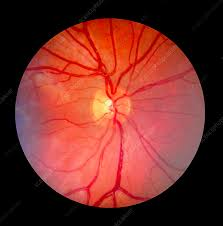
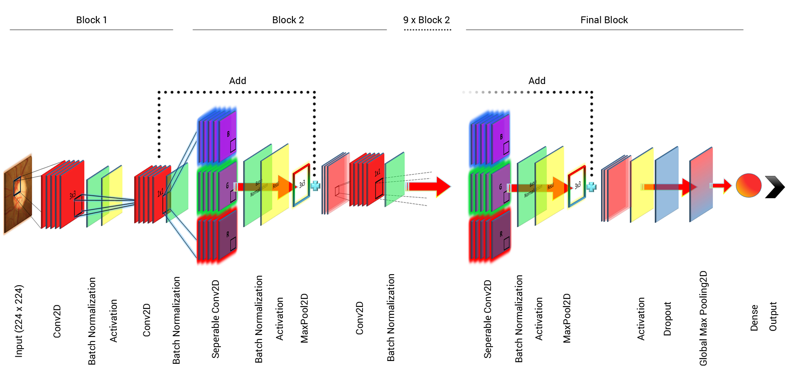
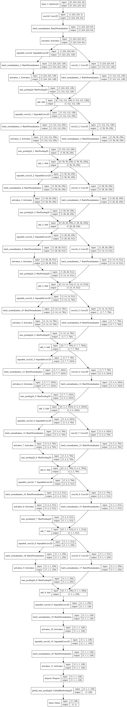

# GC-NET
The project mainly focuses on efficiently classifying between a glaucomatous and normal eye.

## Introduction

Glaucoma is the second most dominant reason for irreversible blindness, resulting in damage to the optic nerve. Ophthalmologist diagnoses this disease using a retinal examination of the dilated pupil. Since the diagnosis is a manual and laborious process, an automated approach for faster diagnosis is desirable. Convolutional neural networks (CNN) can allow automating the diagnosis procedures due to its self-learning capability.  This project presents a deep learning-based glaucoma classification network (GC-NET) for classifying a retinal image as glaucomatous or non-glaucomatous.

 

## Datasets

**(i) DRISHTI-GS:** The dataset comprises of 101 retinal fundus images with 30 normal images and 71 glaucomatous images acquired using a retinal fundus camera. The ground truth for comparison of implemented approaches comprises of the ‘normal/abnormal’ labels and soft segmented maps of ‘disc/cup’ generated by the researchers of the IIIT Hyderabad in alliance with Aravind eye hospital in Madurai, India. It also includes a .txt file for each retinal image comprising of CDR values, which is a significant diagnostic parameter for glaucoma. Further, the images in the data repository are gathered from people of varying age groups visiting the hospital, with images acquired under varying brightness and contrast.
*Link to dataset:* (https://cvit.iiit.ac.in/projects/mip/drishti-gs/mip-dataset2/Home.php)

**(ii) RIM-One:** This dataset comprises of 166 retinal fundus images with labels “glaucoma” or “non-glaucoma” followed by ground truth of cup and disc. The images in the dataset are acquired under different brightness and contrast using Nidek AFC-210 retinal fundus camera. It includes 92 normal images and 74 abnormal images (glaucoma/suspect).

## Approach

For glaucoma detection, we first performed data augmentation on our datasets and increased the number of images from 267 images(after combining both the datasets) to 1602 images. 

The input fundus images to the CNN model were cropped to the size 512 x 512 pixels and further resized to 224 x 224 pixels in RGB format. Since the original size of the images were quite large, CNN was not able to train due to the high-power computation, therefore, the images were resized to 224 x 224 pixels, pertaining to the optic disc. The proposed model included 76 layers with Input (1) RGB image of size 224 x 224 pixels, Convolutional (21), Maxpooling (10), Batch Normalization (21), Activation (11), Add (9), Dropout (1), and Dense layers (2). All the layers of convolution involved filters of size (1,1) and (3,3) with 64, 128, 256, 784 and 1024 number of filters in different layers activated using ReLU activation function. The loss of data between layers was reduced by the Add layers in each block to merge the output of the previous block and upcoming block. The maxpool layers were used to reduce the spatial dimensions of the image by selecting the maximum values from the processed image. The batch normalized the previous layer activations by applying a transformation to maintain the mean activation close to 0 and standard deviation close to 1. The activation layers were used to bring non-linearity in the output of previous layers. The linear activation function was used to bring out the linearity in the output of the layers, and the dropout layer was used to prevent the model from overfitting. The model used a dropout rate of 0.2 with global maxpooling layer to convert the 2D output of the previous layer to 1D prediction output. Two dense layers were used to form a fully-connected neural network with the unit argument of 32 and 1 with ReLU and sigmoid activation arguments respectively. 
The optimizer and loss functions such as adadelta with a learning rate of 0.01 and binary_crossentropy were used respectively, and the logistic regression approach was used to classify the glaucomatous and normal images. 

## Model Architecture

The figure below shows our model aarchitecture. We have used Xception network as our base model and created a custom architecture which is trained to classify between a glaucomatous eye and normal eye.

## References

1. Juneja M, Thakur N, Thakur S, Uniyal A, Wani A, Jindal P. GC-NET for classification of glaucoma in the retinal fundus image. Machine Vision and Applications. 2020 Jul;31(5):1-8.
2. Chollet F. Xception: Deep learning with depthwise separable convolutions. InProceedings of the IEEE conference on computer vision and pattern recognition 2017 (pp. 1251-1258).
3.Szegedy C, Ioffe S, Vanhoucke V, Alemi A. Inception-v4, inception-resnet and the impact of residual connections on learning. arXiv preprint arXiv:1602.07261. 2016 Feb 23.
